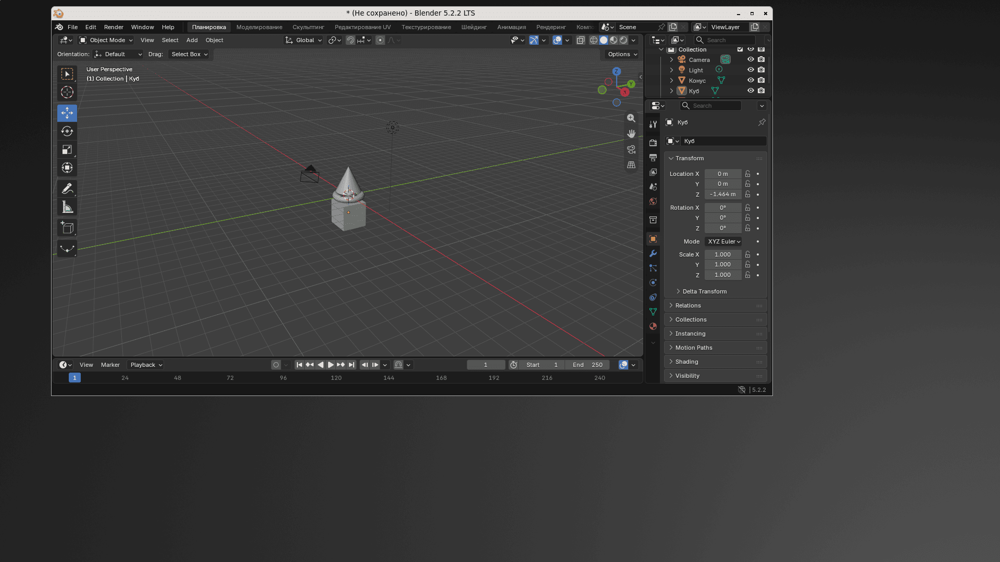

# NeCompositor

A lightweight **Wayland stacking compositor** built for fast, no-nonsense Linux desktops.

NeCompositor is a lean fork of [LabWC](https://github.com/labwc/labwc), crafted with three things in mind: minimalism, predictable behavior, and minimal resource usage. Whether you're building a lightweight desktop setup from scratch or just want a rock-solid, snappy Wayland compositor on your favorite distro, NeCompositor gets out of your way and does the job.

It serves as the flagship compositor for the [NeDE](https://github.com/AptiloOfficial/nede), and works perfectly as a standalone session.

## What’s Under the Hood?

NeCompositor stands on the shoulders of the incredible [LabWC](https://github.com/labwc/labwc) project. Huge thanks to Johan Malm, Consolatis, tokyo4j, and the 100+ contributors who built the foundation we rely on.

## Screenshots



*Blender 5.2.2 LTS running natively on NeCompositor.*

## Current State

It’s an active, early-stage fork — but it's daily-driver material and rock solid for everyday use.

## Highlights

* Openbox-inspired stacking window management
* Clean, XDG-compliant configuration setup
* Full support for both client-side (CSD) and server-side (SSD) decorations
* Crisp HiDPI scaling out of the box
* Rich protocol support via wlroots: `output-management`, `layer-shell`, and `foreign-toplevel`
* Drop-in compatibility with Openbox themes
* XWayland is disabled by default in standard builds for a smaller memory footprint

## Where It Fits In

NeCompositor is the default compositor driving **NeDE** — a lightweight, C-based GTK3 desktop environment.

That said, it isn't locked into any ecosystem. You can drop it into any Wayland session and pair it with your favorite panel, launcher, or status bar.

## Getting Configured

Your configuration lives in `~/.config/necompositor/`:

| File | What it does |
| --- | --- |
| `rc.xml` | Primary config file (LabWC-compatible XML format) |
| `menu.xml` | Desktop context menu layout |
| `autostart` | Shell script triggered at launch |
| `shutdown` | Shell script triggered on exit |
| `environment` | Custom environment variables |
| `themerc` | Theme overrides |

*No config? No problem.* NeCompositor ships with sensible built-in defaults, so it works right out of the box.

To reload your changes on the fly:

```bash
necompositor --reconfigure

```

## Custom Themes

NeCompositor looks for themes in these directories (using the first match it finds):

```text
~/.local/share/themes/<theme-name>/necompositor/themerc
~/.themes/<theme-name>/necompositor/themerc
/usr/share/themes/<theme-name>/necompositor/themerc

```

It fully supports classic Openbox themes. Check out `docs/themerc` for a complete reference guide.

## Building from Source

```bash
meson setup build --prefix=/usr --wrap-mode=nofallback
ninja -C build
sudo ninja -C build install

```

### Runtime Dependencies

* `wlroots 0.18`
* `wayland-server ≥ 1.24`
* `libinput`, `xkbcommon`
* `libxml2`, `cairo`, `pango`, `glib-2.0`
* `libpng`
* `librsvg ≥ 2.46` *(optional)*
* `libsfdo` *(optional)*

*Note: XWayland is enabled by default. To build without it, pass `-Dxwayland=disabled`.*

### Build Dependencies

* `meson`, `ninja`
* `gcc` or `clang`
* `wayland-protocols`

### Want to disable XWayland?

Just pass the flag during setup:

```bash
meson setup build -Dxwayland=disabled

```

## How to Run It

Fire it up straight from a TTY or your preferred display manager:

```bash
necompositor

```

### Keybindings

If you don't have a custom `rc.xml` yet, here are the default shortcuts:

| Shortcut | Action |
| --- | --- |
| Super-Return | Launch terminal |
| Super-Q | Close active window |
| Super-A | Toggle maximize window |
| Alt-Tab | Switch to next window |
| Alt-Shift-Tab | Switch to previous window |
| Alt-F4 | Close active window |
| Alt + Left Click | Drag/move window |
| Alt + Right Click | Resize window |
| Alt + Arrow | Snap window to screen edge |
| Super + Arrow | Tile window to half screen |

Click anywhere on the desktop wallpaper to open the root menu.

## Gaming & Cursor Lock

Cursor confinement has been supported since LabWC 0.6.2. If you're running older kernels or hit issues with specific titles, spinning up a nested `gamescope` instance does the trick:

```bash
gamescope -f -- %command%

```

## Project Heritage

NeCompositor originated as a fork of LabWC 0.8.4. Every original commit and contributor credit remains fully intact in our git history. Run `git log` to explore the lineage.

* **Upstream:** [https://github.com/labwc/labwc](https://github.com/labwc/labwc)
* **This Fork:** [https://github.com/AptiloOfficial/necompositor](https://github.com/AptiloOfficial/necompositor)

## License

GPL-2.0-only. Grab the details in the `LICENSE` file. 

Original codebase © the LabWC contributors.

## See Also

* **LabWC** — The upstream project that started it all
* **wlroots** — The core library driving the compositor
* **Openbox** — The inspiration behind the configuration layout

Maintained with care by @AptiloOfficial.
